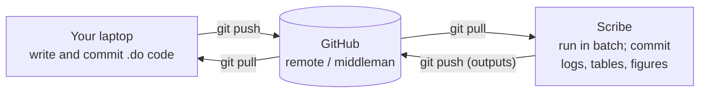

# Local ↔ server sync

Your code is written on your laptop and runs on Scribe, so it has to move between the two.
There are **two ways I move code**, and they trade off simplicity against safety and history.
Here's how I think about both so you can pick deliberately.

!!! info "Direction matters"
    You sync **code** laptop → Scribe, and code changes Scribe → laptop. You **never** move
    data Scribe → laptop. Keeping data on the server is the whole game — see
    [Data safety](data-safety.md).

## The two methods at a glance

| | **A. File transfer (FileZilla)** | **B. git** |
|---|---|---|
| What it is | Drag `.do` files between laptop and Scribe in a transfer client (FileZilla, Cyberduck, `scp`/`rsync`) | `git push` from laptop, `git pull` on Scribe (and back) |
| Setup cost | Almost none — install the client, enter your SSH login | One-time: install git, a GitHub token for pushing, optionally a Scribe-side clone |
| Learning curve | None | Real — pull/push/commit, and the occasional merge conflict |
| Version history | **None** on the round trip | **Full** — every change recoverable, with who/when |
| "Which side is newer?" | You track it by hand; easy to overwrite the wrong file | git tells you; conflicts are surfaced, not silently lost |
| Data-leak protection | Manual discipline only — nothing stops you dragging `dta/` off the server | Structural — `git pull` brings only code; a [pre-push hook](#protecting-data-on-the-server-the-pre-push-hook) blocks pushing data off the server |
| Best for | A quick one-file fix; someone who doesn't use git | The normal workflow; anything you want preserved and auditable |

## Method A — FileZilla (manual transfer)

In FileZilla, open **Site Manager → New Site**: Protocol **SFTP**, Host `Scribe.ssds.ucdavis.edu`,
Logon Type **Ask for Password**, and your **Kerberos** username. Connect (with the DSS VPN on),
navigate to the project folder, and drag the changed `.do` files across. To save a change made
on Scribe, drag it back the same way.

**Costs to keep in mind:**

- No history. If you overwrite a file with an older copy, the newer version is just gone.
- No safety net against data egress. The client will just as happily drag `dta/` to your
  laptop as it drags `.do` files up — *you* are the only thing preventing that. Never select
  data folders.
- Two-way drift. If you edited on both sides, you have to remember which file is current.

!!! tip "Using FileZilla? Don't drag `.git/` over"
    If you move the repo by manual transfer, exclude the `.git/` directory — the FileZilla
    workflow doesn't need git's internals on Scribe, and it keeps GitHub credentials off the
    shared server. (Method B is the deliberate exception: it *does* keep a git clone on Scribe —
    see the token caveat there.)

## Method B — git

With git, the laptop and Scribe never talk to each other directly — they each sync through
**GitHub, which sits in the middle as the *remote*.** You push your code up to GitHub from the
laptop; Scribe pulls it down. Logs, tables, figures, and any other Scribe-side changes travel
back the same way — everything *except* the restricted `data/` and intermediate `estimates/`,
which never leave the server (the [pre-push hook](#protecting-data-on-the-server-the-pre-push-hook)
enforces that).



Nothing moves laptop ↔ Scribe directly the way FileZilla does in Method A — **every move goes
through GitHub.** That indirection is exactly what buys you the version history and the safety
properties below.

The day-to-day rhythm is the everyday git loop — `git pull` to get the latest, `git add` /
`git commit` to save a change, `git push` to send it up — run from the project folder on whichever
machine you're on. See **[Version control using git](git-for-newcomers.md)** for what each command
does, the one-time setup, the glossary, and common errors.

**What you gain:**

- `git pull` brings down **only code, never data** — the data folders aren't tracked, so the
  common mistake of copying restricted data onto a laptop can't happen through git.
- A **[pre-push hook](#protecting-data-on-the-server-the-pre-push-hook)** can block any push that
  would carry a data file off the server — a structural guard, not just discipline.
- Every change is versioned and recoverable, with who/when.

**Costs:** a real learning curve, one-time auth setup (a GitHub personal access token for
pushing), and occasional merge/rebase conflicts.

!!! tip "The token lives on a shared server — scope it tightly"
    Pushing from Scribe means caching a GitHub token there (git stores it in plaintext at
    `~/.git-credentials`). On a shared lab server, use a **fine-grained** personal access token
    scoped to the **single repo**, with **Contents: read/write** only and a **short expiry** —
    so even a leaked token can't reach anything else. Revoke and regenerate if you ever suspect it.

!!! note "Where I actually use this"
    So far I've only set Method B up for **`va_consolidated`** — that project consolidates several
    predecessor pipelines into one, and it's complex enough that the version history and a
    committed audit trail of logs and outputs are well worth git's overhead. It's worked really
    well there. For
    simpler, lower-velocity projects I still reach for FileZilla (Method A): no point taking on
    git's learning curve and auth setup when a drag-and-drop will do. Pick by how much the project
    churns.

### Protecting data on the server: the pre-push hook

Counterintuitively, git with these guards is **safer** for the data than manual transfer — the
protection is structural, not a matter of remembering what not to drag (see
[why “GitHub on the server” is safer, not scarier](git-for-newcomers.md#git-on-scribe-not-just-your-laptop)).

Because git on Scribe pushes to a **public** GitHub repo, the real danger is a `git push` *from
Scribe* accidentally carrying a restricted data file off the server. There are two independent
guards, so a leak would take two deliberate overrides:

1. **`.gitignore`** ([setup here](gitignore-setup.md)) stops `git add` from staging anything under
   `data/` or `estimates/` in the first place.
2. **The pre-push hook** is the backstop: even if someone forces a data file in with `git add -f`,
   the hook still refuses the push.

The hook is a small script tracked in the repo at `.githooks/pre-push`. It scans the commits
you're about to push and **aborts if any file under `data/` or `estimates/` is in the range**
(directory-placeholder `.gitkeep` files are allowed). Git doesn't run tracked hooks automatically,
so you arm it once per machine — most importantly **on the Scribe clone**, where the data lives:

```bash
git config core.hooksPath .githooks      # tell git to use the repo's tracked hooks
chmod +x .githooks/pre-push              # in case the executable bit got stripped
git config --get core.hooksPath          # verify → should print: .githooks
```

!!! warning "Test the guard — a safety net you haven't tripped isn't one"
    Confirm the hook actually fires by deliberately trying to push a fake data file:

    ```bash
    echo "fake" > data/test_leak.dta
    git add -f data/test_leak.dta                          # force past .gitignore
    git commit -m "test: should be blocked by the hook"
    git push origin main                                   # expect: ERROR: refusing to push…
    git reset --hard HEAD~1 && rm -f data/test_leak.dta    # clean up afterward
    ```

    If the push is **not** blocked, something's off — re-check `core.hooksPath` and the exec bit.

If you ever genuinely need to bypass it, `git push --no-verify` skips the hook — and stays visible
in your shell history, so the override is auditable. See [Data safety](data-safety.md) for the
policy this enforces.
</content>
