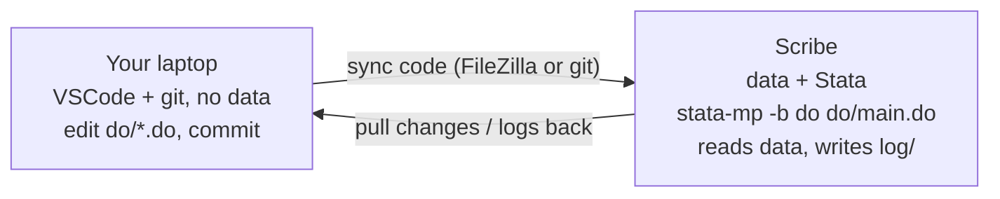

# The recommended workflow

This is the workflow I settled on for making a change to a CEL pipeline safely and reproducibly,
from my laptop to the Scribe server and back. It's what I do — the detail pages linked below go
deeper on each step. Read this one first, then decide what's worth adopting.

!!! abstract "The shape of it"
    **Write code locally → sync it to Scribe → run it in batch on Scribe → read the log →
    repeat.** Confidential data never leaves Scribe; code and shippable results live on GitHub.

## The mental model

Two machines, two jobs:

- **Your laptop** is where you *write and version code*. You have a real editor (VSCode), git,
  and no restricted data.
- **Scribe** is where the code *runs against the data*. The restricted student data lives only
  here, and the analysis runs here.

The connection between them is a **sync step** — you move `.do` files (and only `.do` files)
from laptop to Scribe, and you move code changes back. You never copy data the other way.

!!! info "The one rule everything serves"
    Code lives on **GitHub**. Confidential data lives only on **Scribe**. The two never mix.
    See [Data safety](data-safety.md).

## The loop, step by step

1. **Edit on your laptop in VSCode.** Open the repo, edit the `.do` files. Save. See
   [Editing Stata in VSCode](editing-stata-vscode.md).
2. **Sync the changed code to Scribe** — either drag the files over with FileZilla, or
   `git push` from your laptop and `git pull` on Scribe. See
   [Local ↔ server sync](local-server-sync.md) for the two methods and their trade-offs.
3. **Run it on Scribe in batch:**

    ```bash
    ssh <your_username>@Scribe.ssds.ucdavis.edu
    cd /home/research/ca_ed_lab/projects/<project>
    stata-mp -b do do/main.do
    ```

    Batch mode (`-b`) writes a `.log`/`.smcl` file and survives nothing else — but the *script*
    is saved, so a dropped connection costs you nothing. See
    [Working on Scribe](working-on-scribe.md) for `nohup` (long runs) and the GUI alternative.
4. **Read the log** that the run produced (`log/...`). Fix, and go back to step 1.
5. **When the change is good, commit it** so the next person inherits it — see
   [Version control using git](git-for-newcomers.md).



## Why I write code on my laptop, not in the Stata GUI on the server

A lot of people write their `.do` files in **Stata's do-file editor on the server** — SSH in
(often with the GUI over X11), edit the do file there, run a few lines to test, then run the
whole thing. That works, and it produces saved, reproducible scripts. I just prefer to write on
my laptop and run on Scribe, for three reasons:

- **A better editor.** VSCode gives you syntax highlighting, search across the whole `do/` tree,
  and a side-by-side file view — far easier to navigate a multi-`do` pipeline than Stata's
  built-in editor. See [Editing Stata in VSCode](editing-stata-vscode.md).
- **Version history comes for free.** Writing on the laptop keeps the code in git: every change
  is recoverable, with who changed what and when. See [Version control using git](git-for-newcomers.md).
- **Your editing doesn't depend on the connection.** Edit locally and a laggy or dropped SSH/X11
  session never touches your editor — you keep typing and sync when you're ready. Edit in a GUI
  session on the server and a dropped connection can cost you whatever's unsaved in the buffer
  (and the lag is a nuisance).

Either way, the *authoritative* run is a
[batch run](working-on-scribe.md#running-stata-batch-vs-gui) of `do/main.do` — that's what's
reproducible (see [Reproducible pipelines](reproducible-pipelines.md)). Poking at a few lines
interactively to test is completely fine; just make sure the keepers land in the saved `.do`
file. That's the whole reason I work this way; your mileage may vary.

!!! tip "Where to go next"
    - [Editing Stata in VSCode](editing-stata-vscode.md) — the editor setup
    - [Local ↔ server sync](local-server-sync.md) — FileZilla vs git, with costs
    - [Working on Scribe](working-on-scribe.md) — connecting and running (batch, GUI, screen)
    - [gitignore setup for data security](gitignore-setup.md) — keep data out of GitHub
</content>
