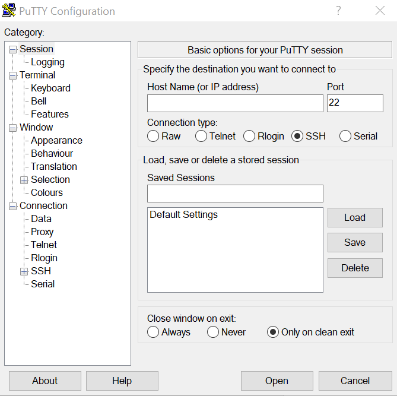
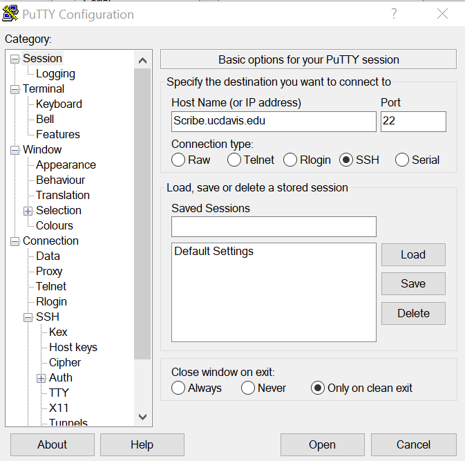
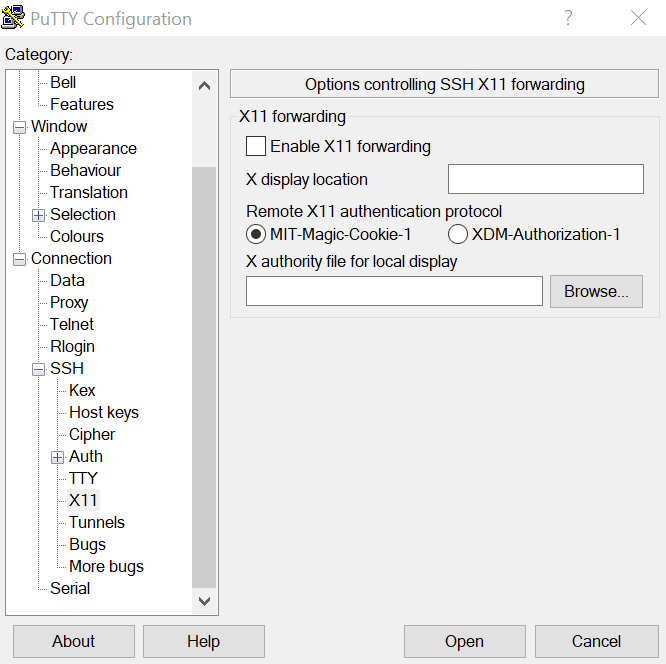
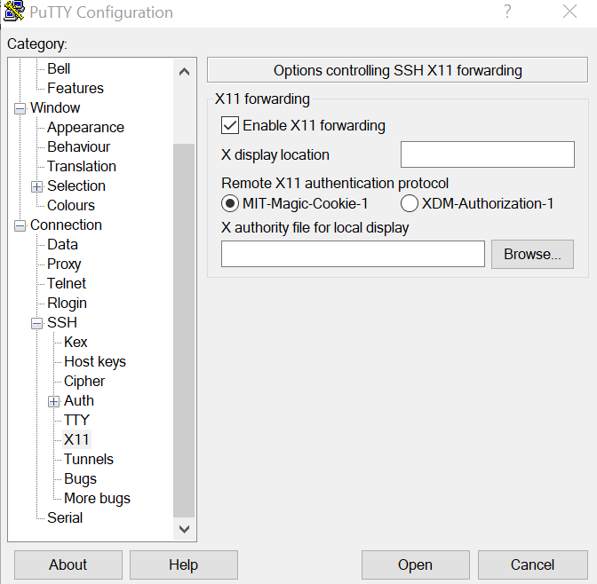
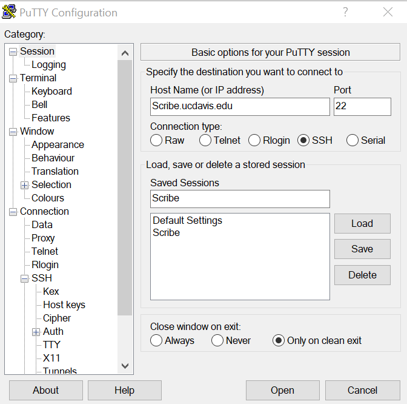
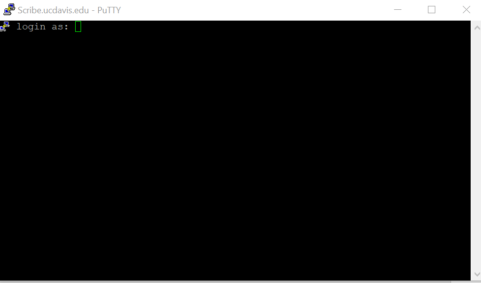

# Stata GUI on Windows (Xming + PuTTY)

*The standard lab onboarding walkthrough for running the Stata GUI on Scribe from a Windows
machine.*

This uses **X11 forwarding** — a mechanism that runs Stata on Scribe but forwards its windows to
your local Windows machine — via **PuTTY** (an SSH client) and **Xming** (an X server).

!!! note "Before you start"
    - The screenshots below show the host as `Scribe.ucdavis.edu`; the current host is
      **`Scribe.ssds.ucdavis.edu`** — use that.
    - Connect to the **DSS VPN** first (see [Working on Scribe](working-on-scribe.md)).

## 1. Install PuTTY and Xming

- **PuTTY** — from the [PuTTY download page](https://www.chiark.greenend.org.uk/~sgtatham/putty/latest.html),
  get the `.msi` installer that matches your machine (32- or 64-bit) and run it. Defaults are fine.
- **Xming** — install from [SourceForge](https://sourceforge.net/projects/xming/).
- **Launch Xming.** It minimizes to an icon in the system tray; just leave it running.

## 2. Configure PuTTY

Open PuTTY. You'll see the configuration window:



In **Host Name (or IP address)**, type `Scribe.ssds.ucdavis.edu` (the screenshot shows the older
`Scribe.ucdavis.edu` form):



In the **Category** panel on the left, scroll to **SSH**, expand it, and click **X11**:



Check **Enable X11 forwarding**, and under **Remote X11 authentication protocol** select
**MIT-Magic-Cookie-1**:



## 3. Save the session (optional)

Go back up to **Session** in the Category panel, type a name (e.g. `Scribe`) under **Saved
Sessions**, and click **Save**. Next time, just load the saved session and everything is
pre-filled.



## 4. Connect and launch Stata

With **Xming running** and the **DSS VPN connected**, click **Open**. At the prompt, type your
Scribe username and press Enter, then your password (keystrokes won't show):



Once you're at the command line, set your lab group permissions and launch the GUI:

```bash
go_sbac                # set lab group permissions (run each login)
xstata-mp              # or xstata-se, depending on the Stata edition you want
```

The Stata GUI opens on your desktop — that's it.

!!! tip "Use the GUI for exploration, not for writing code"
    The GUI is handy for poking at the data, but anything you want to keep belongs in a saved
    `.do` file run in batch. See [Working on Scribe](working-on-scribe.md) for the batch workflow
    and [Editing Stata in VSCode](editing-stata-vscode.md) for writing your code.
